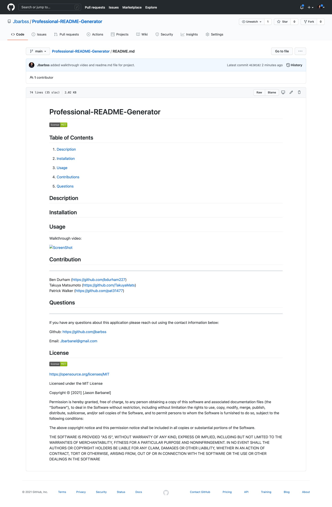

# Professional-README-Generator 


[](https://spdx.org/licenses/MIT.html)
 ## Table of Contents
1. [Description](#description)

2. [Installation](#installation)

3. [Usage](#usage)

4. [Contributions](#contributions)

5. [Questions](#questions)


## Description

I have built an application that is a creates a README.md file based on user input from the command line in Terminal/Bash. The application uses the inquirer NPM package and was built using JavaScript and node.js.


## Installation

Make sure to have node.js installed before running application.
if not please go here https://nodejs.org/en/download/package-manager/

Once Node.js is installed please enter the following:
```
npm install

npm init

npm i inquirer

```

## Usage

The application will be invoked by using the following command:

```bash
node index.js
```


Walkthrough video: 

 

https://drive.google.com/file/d/1aUAgFX97OaLyGDrIbjB4rp-M2I3cIq16/view

Screen Shot of Generated Readme:



 
## Contribution
---

Ben Durham (https://github.com/bdurham227)
<br>
Takuya Matsumoto (https://github.com/TakuyaMats)
<br>
Patrick Walker (https://github.com/pat31477)
<br>

## Questions
 ---
 If you have any questions about this application please reach out 
 using the contact information below:

Github: https://github.com/jbarbss

Email: Jbarbanel@gmail.com


## License
 
[](https://spdx.org/licenses/MIT.html)

   https://opensource.org/licenses/MIT

Licensed under the MIT License

Copyright © [2021] [Jason Barbanel]
    
 Permission is hereby granted, free of charge, to any person obtaining a copy of this software and associated documentation files (the "Software"), to deal in the Software without restriction, including without limitation the rights to use, copy, modify, merge, publish, distribute, sublicense, and/or sell copies of the Software, and to permit persons to whom the Software is furnished to do so, subject to the following conditions:
        
The above copyright notice and this permission notice shall be included in all copies or substantial portions of the Software.
        
THE SOFTWARE IS PROVIDED "AS IS", WITHOUT WARRANTY OF ANY KIND, EXPRESS OR IMPLIED, INCLUDING BUT NOT LIMITED TO THE WARRANTIES OF MERCHANTABILITY, FITNESS FOR A PARTICULAR PURPOSE AND NONINFRINGEMENT. IN NO EVENT SHALL THE AUTHORS OR COPYRIGHT HOLDERS BE LIABLE FOR ANY CLAIM, DAMAGES OR OTHER LIABILITY, WHETHER IN AN ACTION OF CONTRACT, TORT OR OTHERWISE, ARISING FROM, OUT OF OR IN CONNECTION WITH THE SOFTWARE OR THE USE OR OTHER DEALINGS IN THE SOFTWARE


